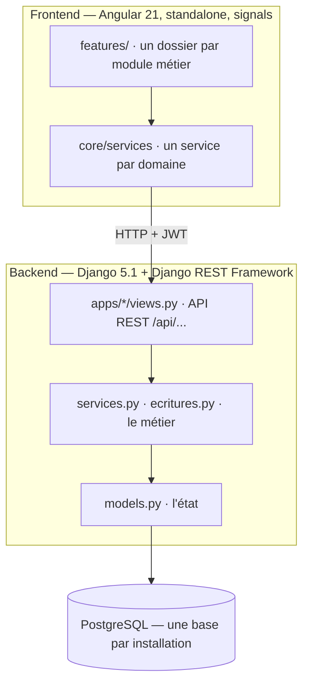
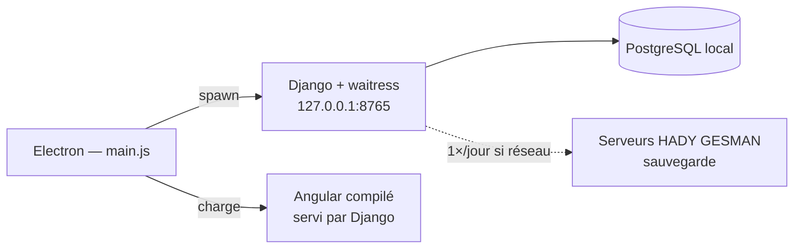
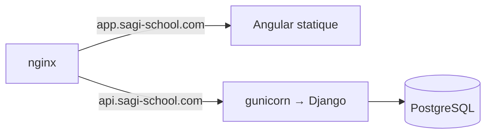
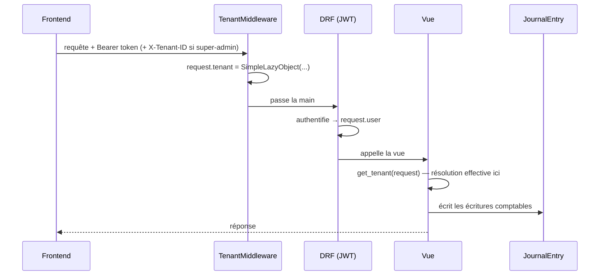

# 1 — Architecture

## Vue d'ensemble

Trois couches, et deux façons de les emballer.

Le frontend ne parle **jamais** à la base. Toute règle métier est côté Django.
Un même appel d'API doit produire le même résultat qu'il vienne de l'interface,
d'un test, ou d'une commande de maintenance — c'est ce qui permet de peupler une
instance de démonstration ou de réparer une école en rejouant les vues.

## Les deux modes de déploiement

Le même code, deux emballages. Le mode est décidé à la compilation du frontend
(`frontend/src/environments/`) et par le fichier de réglages Django utilisé.

### Mode local — l'école héberge

Electron démarre un serveur Django sur `127.0.0.1:8765`, puis ouvre une fenêtre
sur cette adresse. Django sert aussi le frontend compilé — voir la fin de
`backend/config/urls.py`, qui monte `FRONTEND_DIR` et renvoie `index.html` sur
toute route inconnue (fallback SPA).

Le logiciel **fonctionne sans internet**. C'est décisif : beaucoup d'écoles ont
une connexion intermittente. Seule la sauvegarde vers HADY GESMAN a besoin du
réseau, et elle attend patiemment.

**Réglages** : `backend/config/settings/production.py`, généré à la première
installation à partir de `production.example.py` (voir plus bas).

### Mode cloud — HADY GESMAN héberge

Plusieurs écoles sur une seule installation, séparées par le mécanisme
multi-tenant (document 4). Le super-administrateur de HADY GESMAN bascule d'une
école à l'autre.

**Réglages** : `backend/config/settings/cloud.py`, tout piloté par variables
d'environnement, HTTPS strict, CORS limité à `app.sagi-school.com`.
Procédure complète dans `backend/deploy/DEPLOY.md`.

## Les fichiers de réglages Django

`backend/config/settings/` :

| Fichier | Usage | Base de données |
|---|---|---|
| `base.py` | Socle commun, importé par tous | — |
| `local.py` | Développement | PostgreSQL locale, valeurs par défaut |
| `production.py` | **Mode local chez le client** — *généré*, jamais commité | PostgreSQL du poste |
| `production.example.py` | Le gabarit dont `production.py` est tiré | — |
| `cloud.py` | Serveur HADY GESMAN | Variables d'environnement |

`base.py` lit `backend/.env` avec une tolérance d'encodage (UTF-8 puis cp1252) :
un `.env` édité dans le Bloc-notes Windows arrive souvent en ANSI, et
python-decouple plante dessus en UTF-8 strict.

> **L'existence de `production.py` est le drapeau « déjà installé ».**
> Electron le teste au démarrage (`ensureProductionConfig` dans
> `electron/main.js`) : absent, il ouvre l'assistant d'installation. Une mise à
> jour qui écrase ce fichier fait donc réapparaître l'assistant sur une école en
> production. Voir le document 12.

## Les applications Django

`backend/apps/` — une application par domaine métier.

| Application | Responsabilité |
|---|---|
| `tenants` | L'établissement : identité, réglages, régime de paie, échéances |
| `users` | Comptes et rôles |
| `licences` | Formule souscrite, expiration, modules ouverts |
| `eleves` | Élèves, sections tarifaires, services optionnels, bourses, organismes |
| `paiements` | Exercices, encaissements, clôture, report des reliquats |
| `comptabilite` | Journal, grand livre, balance, états financiers, budget, immobilisations |
| `fiscal` | Obligations de l'établissement (IS, CFCE, TVA, CEL, retenues) |
| `rh` | Personnel, bulletins de paie, avances |
| `academique` | Niveaux, classes, matières, évaluations, notes, bulletins |
| `daara` | Mémorisation coranique (licence Taxawu Daara) |
| `gmrf` | Mobilisation de ressources : dons, subventions, tontines, prêts |
| `gouvernance` | Projets, ressources, provisions, rapprochement, traçabilité |
| `dashboard` | Indicateurs agrégés et journal d'audit |
| `sauvegarde` | Sauvegarde cloud des installations locales |

`backend/core/` n'est pas une application Django mais le socle partagé :
classes de base des modèles, résolution du tenant, middleware, permissions.

## Le cycle d'une requête

La résolution du tenant est **paresseuse** exprès : le middleware s'exécute
avant l'authentification DRF, donc `request.user` n'est pas encore connu au
moment où le middleware tourne. `SimpleLazyObject` diffère la résolution
jusqu'à la première lecture, dans la vue, quand l'utilisateur est authentifié.
Voir `backend/core/middleware.py` et `backend/core/tenant.py`.

## Choix structurants, et pourquoi

**Identifiants UUID partout.** `TimeStampedModel` dans `backend/core/models.py`
donne à chaque objet un `UUIDField` en clé primaire. En comptabilité, un
identifiant séquentiel laisse deviner le volume d'activité d'un établissement ;
un UUID non. Cela permet aussi de fusionner ou d'importer des données sans
collision de clés.

**Aucune écriture comptable saisie à la main.** Il n'y a pas d'écran de saisie
d'écriture. Chaque opération métier — encaissement, charge, bulletin de paie,
immobilisation, prêt — produit ses écritures dans le même appel. C'est ce qui
garantit que le journal reflète l'activité réelle. Voir le document 5.

**Rien n'est jamais supprimé.** Une annulation écrit des contre-écritures ; une
modification écrit des contre-écritures puis les nouvelles. SYSCOHADA l'exige,
et cela rend chaque chiffre explicable. Cherchez les sources `ANNUL_*` dans
`JournalEntry`.

**Le frontend n'a aucune règle métier.** Il affiche et il envoie. Le calcul du
dû d'un élève, du niveau d'alerte, du net à payer d'un bulletin, tout est côté
Django, souvent en propriété calculée du modèle. Un même chiffre affiché à deux
endroits doit venir du même calcul — voir le document 12, c'est la classe de
bug la plus coûteuse de ce produit.
