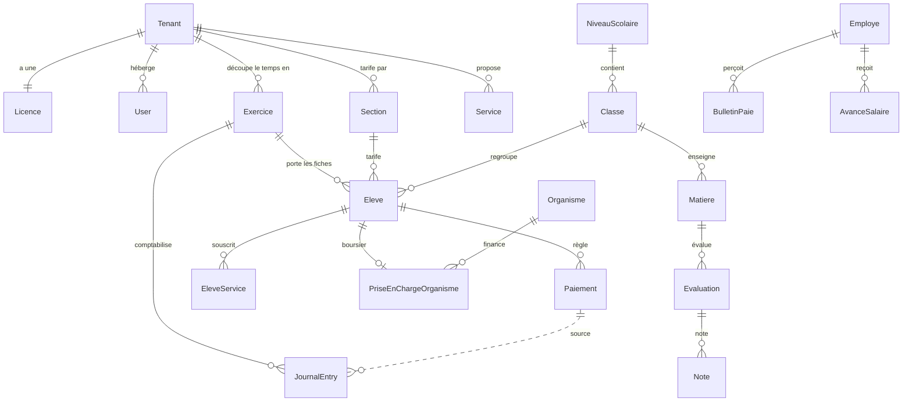

# 3 — Modèle de données et invariants

Ce document donne la carte des entités et, surtout, les **invariants** : les
règles qui doivent rester vraies quoi qu'il arrive. Les violer ne produit pas une
exception, mais des chiffres faux — ce qui est bien pire.

## Les classes de base

`backend/core/models.py` :

```python
class TimeStampedModel(models.Model):      # id UUID + created_at + updated_at
class TenantModel(TimeStampedModel):       # + tenant (ForeignKey obligatoire)
```

**Tout modèle métier hérite de `TenantModel`.** Si vous créez un modèle qui n'en
hérite pas, vous venez de créer une fuite de données entre écoles. La seule
exception légitime est un référentiel partagé par toutes les écoles — par
exemple les sourates du Coran dans `apps/daara`.

## Carte des entités



## Les six notions à ne pas confondre

C'est là que se logent la plupart des malentendus, y compris chez les
utilisateurs. Un développeur qui les confond écrit du code faux sans s'en rendre
compte.

### Exercice ≠ année civile

Un `Exercice` est une **année scolaire** : `annee_scolaire` (« 2025-2026 »),
`date_debut`, `date_fin`, et surtout **`nb_mensualites`** — le nombre de mois
facturés, typiquement 10 et non 12.

`nb_mensualites` est le chiffre le plus structurant du produit : il multiplie la
mensualité pour donner le dû annuel de chaque élève.

Un exercice porte aussi ses **soldes d'ouverture** de trésorerie
(`solde_initial_caisse`, `_banque`, `_mobile`). Ils ne donnent lieu à aucune
écriture : ils sont ajoutés aux mouvements du journal pour obtenir un solde.

### Section ≠ Classe

| | Modèle | Rôle | Exemple |
|---|---|---|---|
| **Section** | `eleves.Section` | Niveau **tarifaire** — décide de ce que paie la famille | Maternelle, Élémentaire, Moyen |
| **Classe** | `academique.Classe` | Groupe **pédagogique** — décide des notes et du rang | CI, CP, CE2, CM2, 6ᵉ |

Un `Eleve` a les deux : `section` (obligatoire en pratique, sinon son dû vaut
zéro) et `classe` (facultative, mais sans elle il n'apparaît dans aucun bulletin).

> **Invariant** — tout ce qui touche à l'argent passe par `section`, tout ce qui
> touche aux notes passe par `classe`. Rapprocher un élève d'une classe par
> comparaison de noms est un bug : c'est exactement ce qui rendait les bulletins
> vides jusqu'en août 2026 (document 12).

### Le dû n'est jamais stocké

Il n'existe aucune colonne « montant dû ». Le dû est **recomposé à chaque
lecture** par des propriétés du modèle `Eleve` :

```
nb_mensualites_dues → prorata de la date d'entrée, ou mois saisis par l'école
total_theorique     → brut, sans prise en charge
total_attendu       → réel : frais − prise en charge + services souscrits
part_organisme      → ce qu'un boursier fait porter à son financeur
part_famille        → total_attendu − part_organisme
```

Conséquence pratique : changer un tarif de section change instantanément le dû
de tous les élèves de cette section, y compris pour les mois déjà passés. C'est
voulu, et c'est ce qui rend catastrophique le fait de créer les élèves **avant**
de saisir les tarifs.

### Prise en charge ≠ bourse

Deux mécanismes que le code sépare rigoureusement :

- **Prise en charge par l'école** (`Eleve.prise_en_charge`,
  `type_prise_en_charge`, `pourcentage_prise_en_charge`) — l'école renonce à une
  part de ses frais. `total_attendu` **diminue**.
- **Bourse d'un organisme** (`PriseEnChargeOrganisme`) — un tiers paie à la place
  de la famille. `total_attendu` **ne bouge pas** : il se répartit entre
  `part_organisme` et `part_famille`.

> **Invariant** — une bourse est une **créance sur l'organisme**, comptabilisée
> au compte `4112`, pas une remise. La traiter comme une remise fait disparaître
> une créance réelle. L'alerte de retard ne porte que sur `part_famille`.

### Reliquat antérieur ≠ dû de l'année

`Eleve.reliquat_anterieur` porte la dette reportée d'un exercice précédent. Elle
est suivie **en parallèle** du dû de l'année, jamais fondue dedans : le niveau
d'alerte reste celui de l'année en cours.

Côté paiement, `Paiement.montant_reliquat` est encaissé mais **ne constate aucun
produit** — le produit a été comptabilisé l'année d'origine, seule la créance
reportée se solde. C'est pourquoi ce montant est absent de toutes les sommes
« recettes de l'exercice ».

### Régime EXERCICE ≠ régime PASSAGER

Pour les daaras. Un ndongo « passager » arrive en cours d'année pour une durée
convenue (`nb_mois_passager`) : il doit ce nombre de mensualités **depuis son
entrée**, sans plafond de fin d'exercice. Un séjour à cheval sur deux exercices
se traite par une réinscription avec les mois restants.

## Le journal comptable

`comptabilite.JournalEntry` — table `journal_entries`. Une ligne = un débit **ou**
un crédit sur un compte.

| Champ | Rôle |
|---|---|
| `no_piece` | Numéro de pièce, séquentiel par école |
| `date_ecriture` | Date comptable (pas la date de saisie) |
| `no_compte` | Compte SYSCOHADA, en texte |
| `debit` / `credit` | L'un des deux, l'autre à zéro |
| `source` | **D'où vient l'écriture** — voir tableau ci-dessous |
| `source_id` | L'objet métier qui l'a produite |
| `ordre` | Rang de la ligne dans la pièce |
| `projet` / `ressource` / `budget_ligne` | Dimensions analytiques, facultatives |

`source` est la **piste d'audit**. Les valeurs en usage :

```
PAIEMENT  CHARGE  BUDGET  INVEST  AMORT  PAIE  AVANCE  RECETTE  MIGRATION
CREANCE_ORGANISME  REPORT  REPORT_RELIQUAT  TRANSFERT  PROVISION  PROVISION_REPRISE
GMRF_FIN  GMRF_COTIS  GMRF_RECEP  GMRF_PRET  GMRF_PRET_ECH  RAPPRO_REG
RECAL_MIGRATION  RECONCIL_MIGRATION
ANNUL_PAIEMENT  ANNUL_PAIE  ANNUL_AVANCE  ANNUL_PROVISION  ANNUL_TRANSFERT
```

> **Invariant** — ne filtrez jamais un total financier sur `source`. Une
> grandeur comme « les charges de l'exercice » se calcule sur les **comptes**
> (classe 6), pas sur l'origine des écritures : sinon toute nouvelle source
> — une paie, un amortissement, un intérêt d'emprunt — disparaît silencieusement
> du total. Ce piège a produit trois bugs distincts dans ce produit. Utilisez
> `apps/comptabilite/resultat.py`.

## Unicité : toujours par tenant

Tout champ séquentiel généré par école — `no_piece`, `matricule`, codes de
projet, références GMRF — doit être unique **par tenant**, jamais globalement :

```python
class Meta:
    constraints = [
        models.UniqueConstraint(fields=['tenant', 'no_piece'],
                                name='uniq_no_piece_par_tenant'),
    ]
```

Une contrainte globale fait échouer le premier reçu `REC-0001` de la deuxième
école avec une `IntegrityError`, donc un 500 sur chaque encaissement. En cloud,
où toutes les écoles partagent une base, c'est immédiat.

> **Piège DRF associé** : DRF 3.15 rend obligatoires les champs d'une
> `UniqueConstraint`. Un champ généré côté serveur (`matricule`, `no_piece`) doit
> donc être déclaré `read_only` ou `required=False` dans le serializer, sinon
> toute création renvoie 400. Voir `apps/eleves/serializers.py`.

## Numérotation des pièces

`apps/paiements/numerotation.py` — lisez la docstring, elle raconte un bug réel.

Le numéro suivant se calcule sur des **nombres**, jamais sur l'ordre
alphabétique : `max('REC-0100', 'REP-0005')` vaut `'REP-0005'` parce que « P »
suit « C ». La séquence est **commune à tous les préfixes** d'une école.

Préfixes en usage : `REC` (reçu), `REP` (reprise de migration), `CHG` (charge et
budget — séquence commune), `IMM` / `INV` (immobilisation), `AMT`
(amortissement), `PAIE`, `AVA` (avance), `ANN` (annulation), `RAN` (à-nouveau),
`BRS` (bourse), `FISC`, `RAP` (rapprochement), `TMP`.

## Matricule de l'élève

`apps/eleves/matricules.py` — format `AAAA-CODE-NNNN`, par exemple
`2025-GSP-0042` : promo, code établissement, rang dans la promo.

> **Invariant** — le matricule est attribué **une seule fois** et suit l'enfant
> jusqu'à sa sortie. Une réinscription le recopie. `annee_entree` et
> `date_entree` sont figées à vie ; `date_inscription`, elle, est repositionnée
> à chaque exercice pour le calcul du prorata et **ne peut donc pas servir de
> référence historique**.
