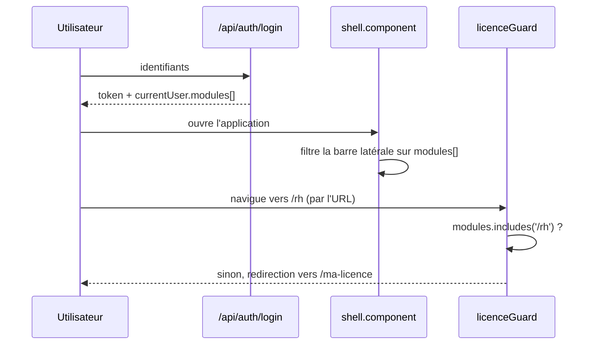

# 6 — Licences et modules

La licence ne change ni le code installé ni les données : elle décide des
**routes accessibles**. Tout se joue dans `backend/apps/licences/models.py`.

## Le modèle

```python
class Licence(TimeStampedModel):
    tenant      = OneToOneField('tenants.Tenant')   # une licence par école
    cle_licence = CharField(unique=True)
    type        = ESSAI | BASIC | PRO | AVANCE | TAXAWU_DAARA
    statut      = ACTIVE | EXPIREE | SUSPENDUE | ESSAI
    date_debut, date_fin
```

## La table de vérité

`Licence.MODULES_PAR_TYPE` — **c'est la seule source**. Ne la dupliquez pas
côté frontend ni dans une documentation commerciale sans la relire ici.

| Route | Essai | Basic | Pro | Avancé | Taxawu Daara |
|---|:---:|:---:|:---:|:---:|:---:|
| `/dashboard` | ● | ● | ● | ● | ● |
| `/eleves` | ● | ● | ● | ● | ● |
| `/paiements` | ● | ● | ● | ● | ● |
| `/suivi-mensuel` | ● | ● | ● | ● | ● |
| `/comptabilite` | ● | — | ● | ● | ● |
| `/academique` | — | — | — | ● | ● |
| `/rh` | — | — | — | ● | ● |
| `/fiscal` | — | — | — | ● | ● |
| `/gmrf` | — | — | — | ● | ● |
| `/gouvernance` | — | — | — | ● | ● |

Deux particularités contre-intuitives, à connaître avant qu'un client ne les
découvre :

- **L'Essai ouvre la comptabilité, pas le Basic.** Une école qui essaie puis
  souscrit un Basic *perd* le module. C'est délibéré (l'essai doit montrer la
  valeur), mais ça surprend.
- **Taxawu Daara a exactement le périmètre d'Avancé**, au tarif le plus bas du
  catalogue. Ce n'est pas une version allégée : c'est le programme de l'éditeur
  pour équiper les daaras.

`/ma-licence` et `/parametres` sont **toujours** ajoutés, y compris licence
expirée ou suspendue — sans quoi l'école ne pourrait ni voir son statut ni
demander un renouvellement.

## Expiration

```python
GRACE_JOURS = 7

@property
def acces_expire(self):
    if self.statut == 'SUSPENDUE':  return True     # coupure immédiate
    if not self.date_fin:           return True
    return timezone.now().date() > self.date_fin + timedelta(days=GRACE_JOURS)

@property
def modules(self):
    always = ['/ma-licence', '/parametres']
    if self.acces_expire:
        return always
    return self.MODULES_PAR_TYPE.get(self.type, []) + always
```

Une licence **expirée** bénéficie de sept jours de grâce. Une licence
**suspendue** coupe immédiatement — c'est le levier réservé aux impayés.

## Comment le gating arrive jusqu'à l'écran



`modules` est une **revendication du jeton JWT**, posée à l'émission par
`CustomTokenSerializer.get_token` (`backend/apps/users/serializers.py`)
aux côtés de `role`, `tenant_id` et `type_licence`. Le frontend s'en sert à
**deux** endroits, et les deux sont nécessaires :

- `layout/shell/shell.component.ts` masque les entrées de menu ;
- `core/guards/licence.guard.ts` bloque la navigation directe par URL.

Masquer le menu sans le garde laisserait passer quiconque tape l'adresse.

> **`modules` vide signifie super-administrateur** (pas de tenant, donc pas de
> licence) : le garde laisse alors tout passer. Si vous changez la forme de ce
> tableau, relisez `licence.guard.ts` — la condition `modules.length === 0` est
> facile à casser.

## Tarifs

Ils sont écrits à deux endroits, et doivent rester synchronisés :

- `frontend/src/app/features/licences/licences.component.ts` — tarif **mensuel**
- `backend/apps/licences/views.py` — tarif **annuel**, égal à mensuel × 12 − 10 %

```
ESSAI 0 · BASIC 25 000 · PRO 50 000 · AVANCE 90 000 · TAXAWU_DAARA 20 000  (F CFA/mois)
```

Le site vitrine `sagi-school.com` vit dans un dépôt séparé et porte une
**troisième** copie de ces tarifs. Toute évolution doit toucher les trois.

## Génération d'une clé

```python
Licence.generer_cle(tenant_rccm) -> "HG-PRO-<année>-<rccm>-<token>-<signature>"
```

Signature SHA-256 tronquée à 8 caractères. La clé sert aussi à authentifier une
école auprès du serveur de sauvegarde (en-tête `X-Cle-Licence`, voir
`apps/sauvegarde/`).

## Modifier le périmètre d'une formule

1. Éditer `MODULES_PAR_TYPE` — et rien d'autre côté backend.
2. Vérifier que la route existe bien dans `frontend/src/app/app.routes.ts`.
3. Mettre à jour le tableau ci-dessus, le guide utilisateur
   (`docs/guide-formation-sagi-school.*`) et le site vitrine.
4. Les écoles existantes prennent le changement à leur **prochaine connexion** :
   `modules` est figé dans le token. Un client qui ne voit pas son nouveau module
   doit se déconnecter et se reconnecter — c'est la première question à lui poser.
