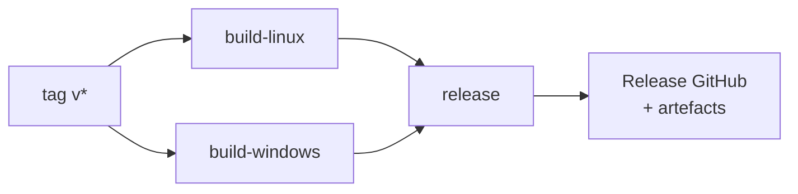
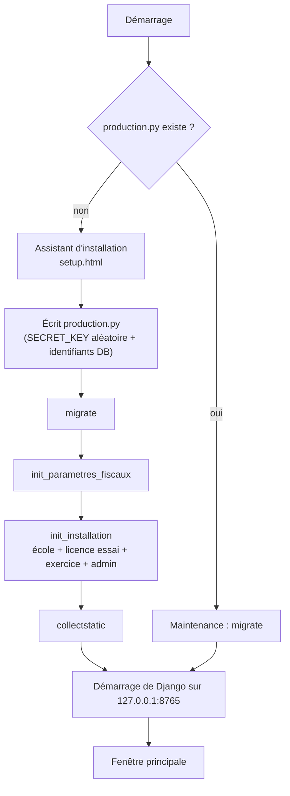

# 10 — Build et déploiement

Deux chaînes distinctes : l'application de bureau, livrée par GitHub Actions, et
le serveur cloud, déployé à la main.

## Application de bureau

### Déclencher une livraison

```bash
git tag v1.37.0
git push origin v1.37.0
```

C'est tout. `.github/workflows/build.yml` se déclenche sur tout tag `v*` et
produit :

| Plateforme | Artefacts |
|---|---|
| Windows | `SAGI SCHOOL Setup.exe` (installateur NSIS) |
| Linux | `sagi-school_*.deb` et `SAGI SCHOOL.AppImage` |

Ils sont attachés à une **release GitHub** portant le nom du tag.

### Ce que fait la chaîne



Chaque travail compile Angular en production, installe les dépendances Electron,
**force la version depuis le tag** (`npm pkg set version="${GITHUB_REF_NAME#v}"`)
puis lance `electron-builder`.

> **La version dans `electron/package.json` n'est pas fiable en lecture.** Elle
> dérive — elle est à `1.13.0` alors que les tags sont bien au-delà. Seul le tag
> git fait foi ; la chaîne l'écrase au moment du build. Ne vous appuyez pas sur
> ce fichier pour connaître la version courante : `git describe --tags` le dira.

### Ce que contient le paquet

`electron/package.json`, section `build` :

- `files` — **le code Electron lui-même** : `main.js`, `preload.js`,
  `licence-check.js`, `splash.html`, `setup.html`, `setup-preload.js`, `assets/`.
- `extraResources` — le backend Django complet (sans `venv`, `__pycache__`,
  `.env`) et le frontend compilé.

> **Tout nouveau fichier Electron doit être ajouté explicitement à `files`.**
> Sinon il est absent du `.exe`, et l'application plante chez le client avec un
> message introuvable en développement — où le fichier est là. Cette règle a
> coûté plusieurs livraisons.

### Ce qui se passe au premier lancement chez le client

`electron/main.js` :



Points à connaître :

- **`production.py` est le drapeau « déjà installé ».** S'il disparaît ou est
  écrasé par une mise à jour, l'assistant réapparaît sur une école en production.
  Il faut alors ressaisir **les mêmes** identifiants de base : `init_installation`
  est idempotente et ne recrée pas d'école fictive, donc rien n'est perdu.
- **L'application ne crée pas la base PostgreSQL.** Seul `install_win.ps1`
  le fait. Voir le document 12.
- **`ensurePythonPackages`** lance `ensurepip`, réinstalle `setuptools` puis
  `pip install -r requirements/base.txt`. `checkPkgResources` vérifie ensuite
  que `pkg_resources` s'importe et affiche un message actionnable sinon.
- Un journal d'installation est écrit sur le disque du client — le chemin est
  donné dans le message d'erreur. Demandez-le systématiquement en support.
- La sauvegarde cloud se déclenche toutes les 24 heures
  (`SAUVEGARDE_INTERVALLE_MS`).

### Tester le build sans livrer

`workflow_dispatch` est activé : on peut lancer la chaîne à la main depuis
l'onglet Actions de GitHub, sans créer de tag. Les artefacts sont produits, la
release ne l'est pas.

## Serveur cloud

La procédure complète — provisionnement, DNS, durcissement, PostgreSQL,
gunicorn, nginx, certificats, sauvegarde hors-site chiffrée — est dans
**`backend/deploy/DEPLOY.md`**, maintenu à part parce qu'il change au rythme de
l'hébergeur.

Fichiers de service fournis : `backend/deploy/gunicorn.service` et
`backend/deploy/nginx.conf`.

### Le déploiement du frontend, dans le bon dossier

> Le frontend se compile **en local**, puis se transfère **directement** vers
> `/opt/sagi-school/frontend/dist/frontend/browser`.
>
> Ce n'est **pas** `/var/www/sagi-app` : ce répertoire existe sur le serveur mais
> n'est servi par rien. Y déposer un build donne l'impression d'avoir déployé
> sans que rien ne change.

Après transfert, **purgez le cache Cloudflare**, sinon les visiteurs continuent
de recevoir l'ancienne version.

Et n'oubliez pas `BUILD_ID` si la livraison touche aux traductions (document 8).

### Basculer une école locale vers le cloud

`apps/sauvegarde/management/commands/importer_ecole.py` importe la base d'une
école locale dans l'installation cloud.

## Sauvegarde des installations locales

`apps/sauvegarde/` :

| Côté | Endpoint | Rôle |
|---|---|---|
| Poste local | `GET /api/sauvegarde/statut/` | Dernière sauvegarde, dumps locaux |
| Poste local | `POST /api/sauvegarde/declencher/` | Dump + envoi immédiat |
| Serveur HADY GESMAN | `POST /api/sauvegarde/recevoir/` | Réception, authentifiée par la clé de licence (`X-Cle-Licence`) |

Stockage sous `SAGI_BACKUPS_DIR/<école>/`, rétention 30 jours, taille maximale
200 Mo par dump.

Le mécanisme est un **envoi de dump complet**, pas une réplication continue :
simple, robuste sur connexion intermittente, et suffisant pour l'usage.

## Ordre de livraison recommandé

1. Tests au vert en local (document 11).
2. Incrémenter `BUILD_ID` si les traductions ont bougé.
3. Fusionner dans `main`.
4. Poser le tag et le pousser — l'application de bureau part toute seule.
5. Déployer le cloud : backend d'abord (migrations), frontend ensuite.
6. Purger Cloudflare.
7. Vérifier une école réelle : connexion, un encaissement, un reçu imprimé.
